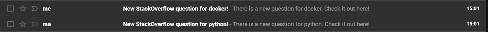

# StackOverflow new questions notifier

An AWS serverless solution which notifies you of new questions created on Stack Overflow.



# Requirements

Before deploying the infrastructure, you must have validated your email address in AWS SES.

# Usage

Deploy the infrastructure so that you will be notified of new Python questions every 5 minutes:

```bash
terraform apply -var "stackoverflow_tags=python" -var "email_address=myemailaddress@gmail.com" -var "notifier_frequency=5 minutes"
```

Deploy the infrastructure so that you will be notified of new Python and Docker questions every 2 minutes:

```bash
terraform apply -var "stackoverflow_tags=python,docker" -var "email_address=myemailaddress@gmail.com" -var "notifier_frequency=2 minutes"
```

# How it works

The Terraform solution deploys an AWS Lambda function which parses the RSS feed of StackOverflow. The parsing leverages pre-existing Lambda layers, namely requests, BeautifulSoup and lxml. For each question that contains at least one tag that you specified, you will receive an email containing a link to the said question.
The lambda function is triggered by an AWS EventBridge rule, which runs as often as specified.

The RSS feed only includes the 30 most recent questions, so if you want to make sure you do not miss a single question you will have to set the frequency of the infrastructure accordingly. This however could end up in you receiving multiple emails for the same question.

# TODOs

* [ ] Support tag groups
* [ ] Support mutually exclusive tags

# Legal

This project has no affiliations with StackOverflow.
